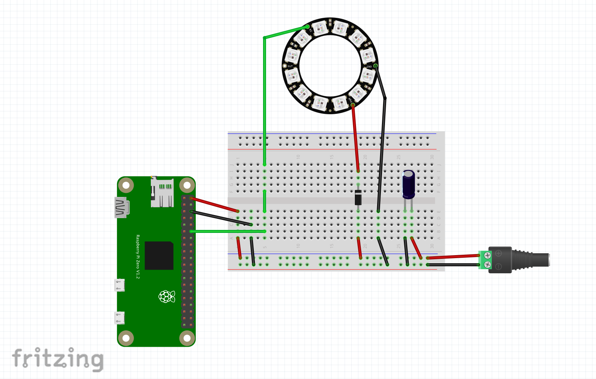

# Nerves_Lamp

Demo Application for CodeMash 2020

## Building
1) Navigate to the `lamp_firmware` directory.
  ```
  cd lamp_firmware
  ```
2) Fetch project dependencies
  ```
  MIX_TARGET=rpi0 mix deps.get
  ```

3) Register your new device (will need device id for next step)
  ```
  mix nerves_hub.device create
  ```

4) Burn firmware to a micro SD card
  ```
  MIX_TARGET=rpi0 MIX_ENV=prod mix nerves_hub.device burn some-device-id-001
  ```


**NOTES**:
* Assumes that you're building this project for a Raspberry Pi Model Zero W but could work with other targets
* More information on nerves hub availabe [here](https://docs.nerves-hub.org/)
* **Use this information and code AT YOUR OWN RISK, the author assumes absoluetely no responsibility or liability for its use.**
* There are some helper scripts in `lamp_firmware/scripts` to make some of this easier


Building out the hardware:



Shopping List, from Amazon:
* [Raspberry Pi Zero W](https://www.amazon.com/dp/B06XFZC3BX/)
* [Raspberry Pi Case](https://www.amazon.com/dp/B01HP636I4/)
* [16GB+ microSD](https://www.amazon.com/dp/B073K14CVB/)
* [Tap Light](https://www.amazon.com/dp/B000BPPN8I/)
* [1000uF Capacitor](https://www.amazon.com/dp/B074RFT3VN/)
* [1N4001 Diode](https://www.amazon.com/dp/B071YWNBVM/)
* [DC Adapter and Plug](https://www.amazon.com/dp/B07KVZHVCS/)
